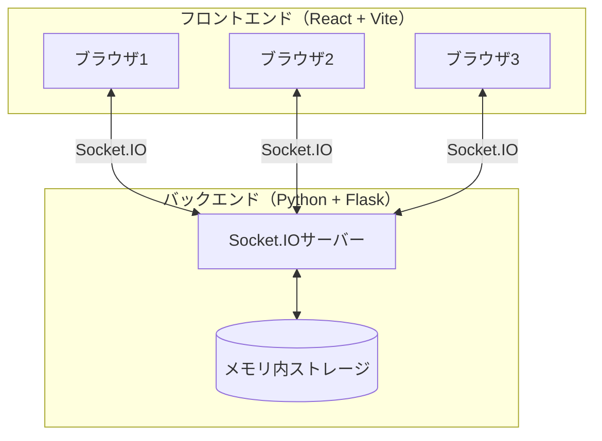
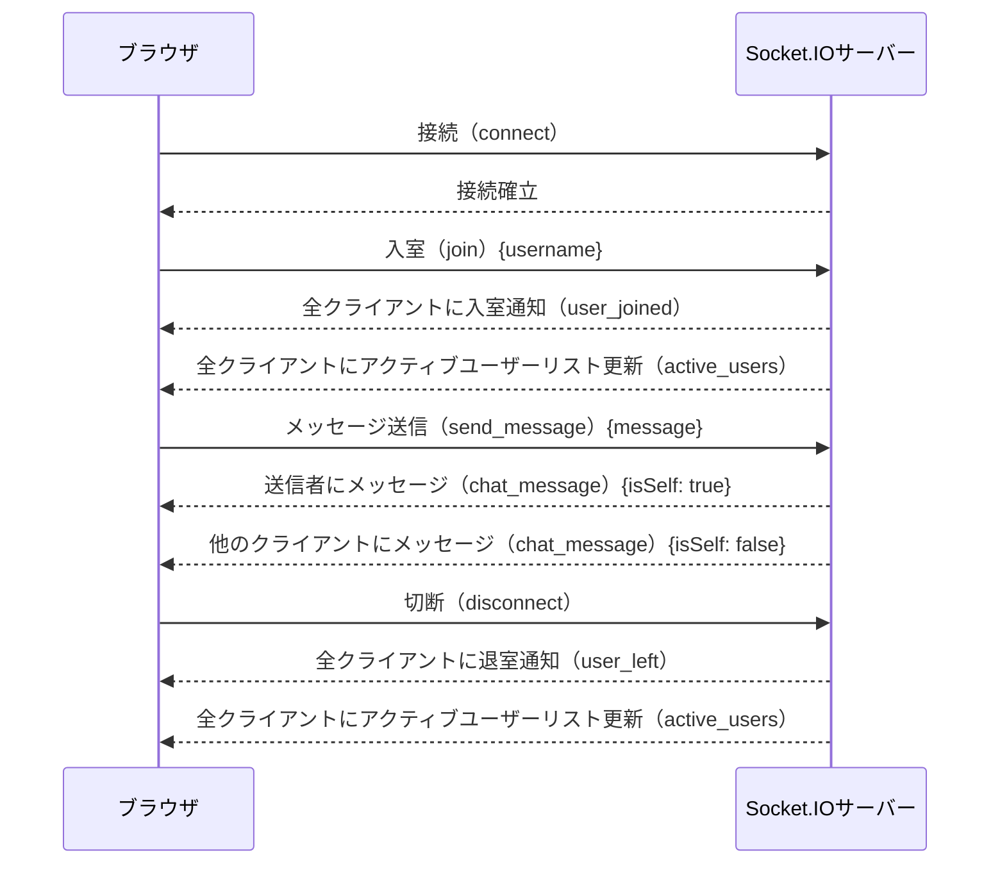
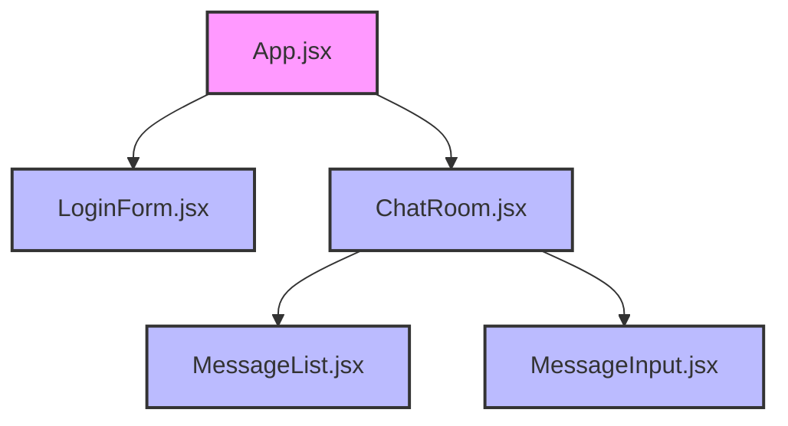
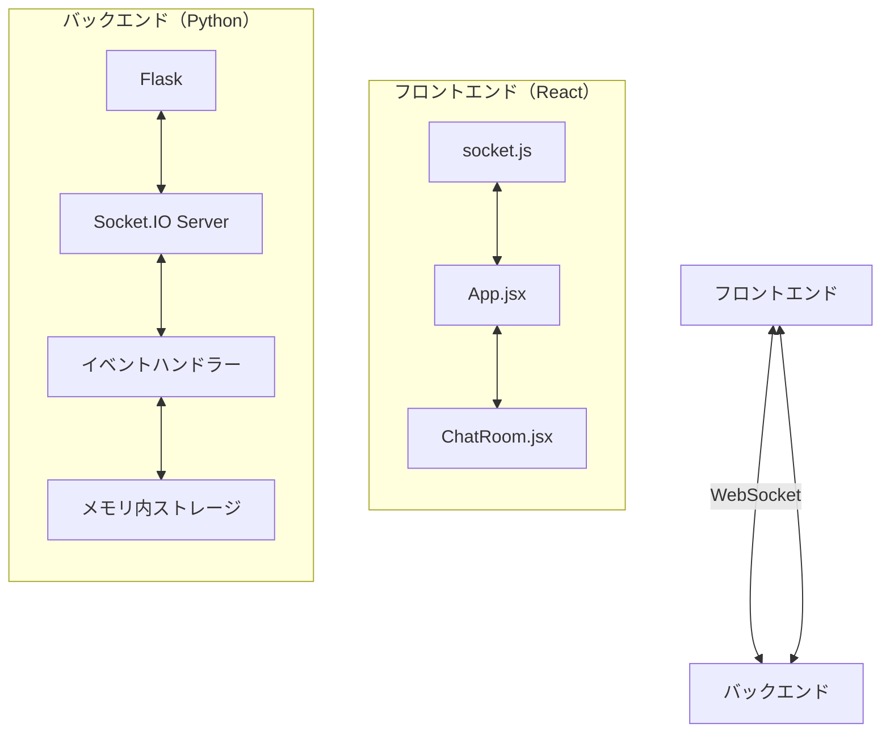

# アーキテクチャ

このドキュメントでは、note-webchatアプリケーションのアーキテクチャについて説明します。

## システム概要

note-webchatは、Socket.IOを使用したリアルタイムWebチャットアプリケーションです。フロントエンドはReact（Vite）で構築され、バックエンドはPython（Flask）で実装されています。

### システム構成図

## データフロー

### ユーザー認証とチャットのデータフロー

## コンポーネント構造

### フロントエンドのコンポーネント構造

### Socket.IO通信フロー

### 状態管理

note-webchatアプリケーションでは、次の状態が管理されています：

- フロントエンド（React）
  - ユーザー認証状態（isLoggedIn）
  - ユーザー名（username）
  - アクティブユーザーリスト（activeUsers）
  - メッセージリスト（messages）

- バックエンド（Python）
  - 接続されたユーザー情報（connected_users）

これらの状態は、Socket.IOイベントを通じて同期されます。
