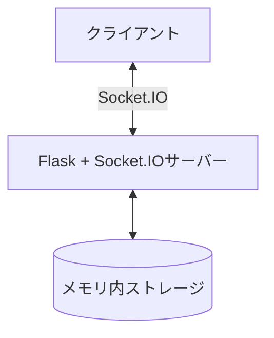
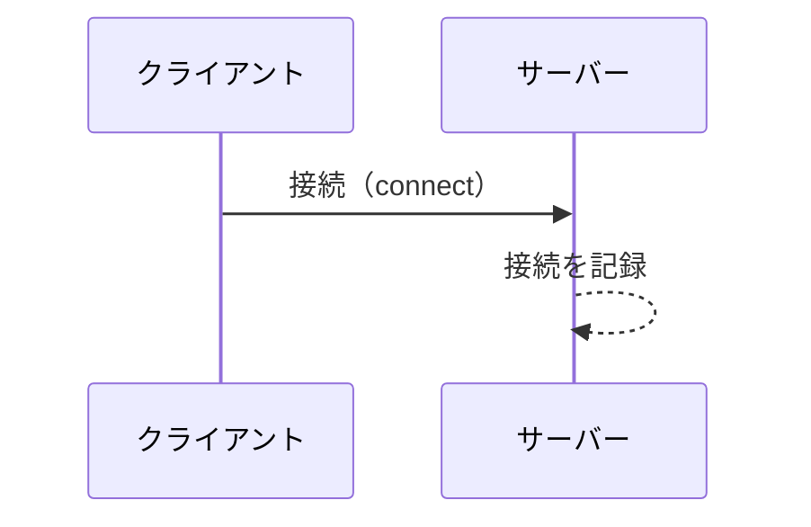
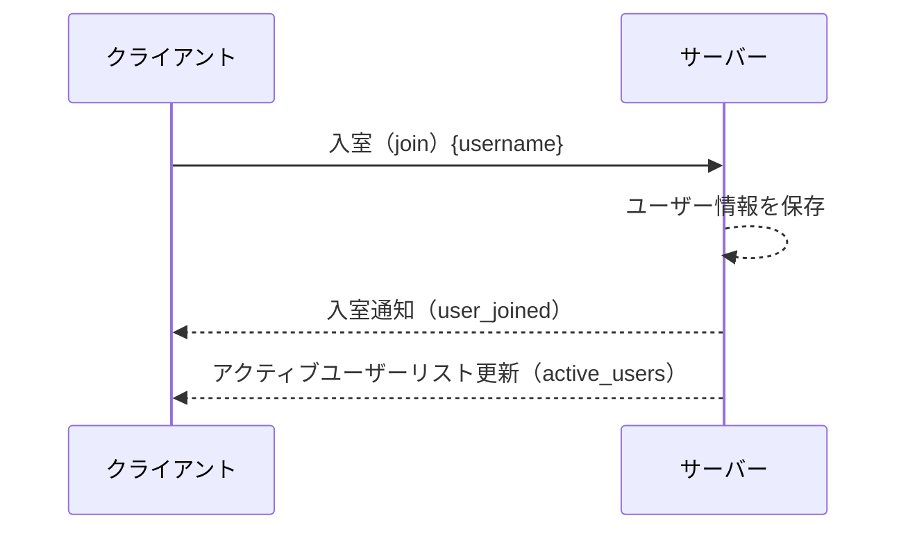
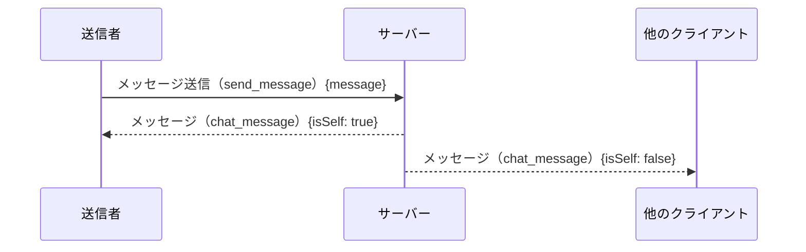
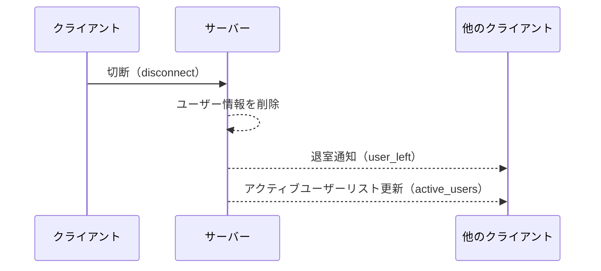

# バックエンド仕様

このドキュメントでは、note-webchatのバックエンド実装について説明します。

## 技術スタック

- Python 3
- Flask: Webアプリケーションフレームワーク
- Socket.IO: WebSocketベースのリアルタイム通信
- Gevent: 非同期I/Oライブラリ

## サーバー構成

バックエンドは、Flask + Socket.IOを使用したWebSocketサーバーとして実装されています。
サーバーはGeventを使用して非同期I/Oを実現しています。



## データモデル

### メモリ内データ構造

サーバーは、以下のデータをメモリ内に保持します：

- `connected_users`: 接続されているユーザー情報
  - キー: セッションID（sid）
  - 値: ユーザー情報（username）

```python
connected_users = {}  # sid -> {"username": username}
```

## イベントハンドラー

### 接続イベント



### 入室イベント



### メッセージ送信イベント



### 切断イベント



## 実行方法

1. 必要なパッケージをインストール:
   ```
   cd backend
   pip install -r requirements.txt
   ```

2. サーバーを起動:
   ```
   python server.py
   ```

3. デフォルトでは、サーバーはポート8000で起動します:
   ```
   http://localhost:8000
   ```
