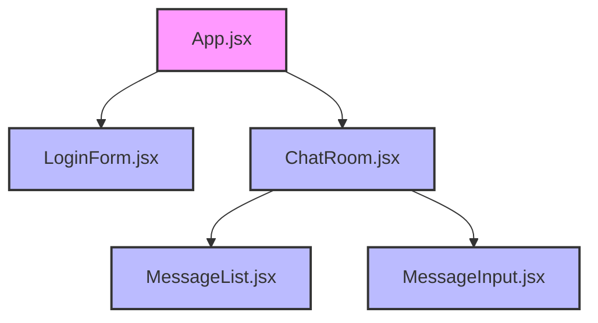
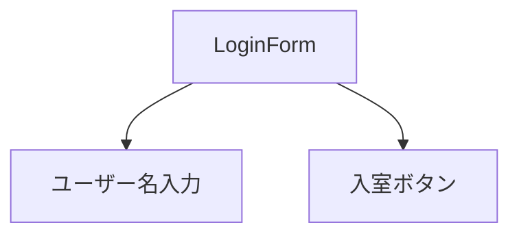
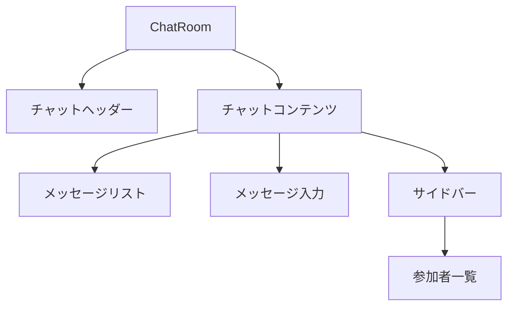

# フロントエンド仕様

このドキュメントでは、note-webchatのフロントエンド実装について説明します。

## 技術スタック

- React: UIライブラリ
- Vite: ビルドツール
- Socket.IO-client: Socket.IOクライアントライブラリ
- CSS: スタイリング

## アプリケーション構造

フロントエンドは、React + Viteで構築されています。
主要なコンポーネントは以下の通りです：



## コンポーネント詳細

### App.jsx

アプリケーションのルートコンポーネントです。次の状態を管理します：

- `isLoggedIn`: ユーザーがログインしているかどうか
- `username`: ログインしているユーザーの名前
- `activeUsers`: アクティブなユーザーのリスト
- `messages`: チャットメッセージのリスト

また、Socket.IOのイベントリスナーを設定し、次のイベントを処理します：

- `user_joined`: ユーザーが入室したときのイベント
- `user_left`: ユーザーが退室したときのイベント
- `chat_message`: メッセージが送信されたときのイベント
- `active_users`: アクティブユーザーリストが更新されたときのイベント

### LoginForm.jsx

ユーザー名を入力して入室するためのフォームコンポーネントです。



### ChatRoom.jsx

チャットルームの主要コンポーネントです。次のコンポーネントで構成されています：

- チャットヘッダー（タイトルと参加者数）
- メッセージリスト（MessageList）
- メッセージ入力フォーム（MessageInput）
- サイドバー（参加者一覧）



### MessageList.jsx

チャットメッセージを表示するコンポーネントです。メッセージの種類に応じて異なるスタイルで表示します：

- システムメッセージ: 入室・退室通知
- 自分のメッセージ: 右寄せで表示
- 他のユーザーのメッセージ: 左寄せで表示

また、新しいメッセージが追加されると自動的にスクロールする機能も実装しています。

### MessageInput.jsx

メッセージを入力して送信するためのフォームコンポーネントです。

## Socket.IO通信

Socket.IOクライアントの設定は、`socket.js`で行われています。
サーバーとの接続設定と基本的なイベントリスナーが定義されています。

```javascript
// Socket.IOクライアントのインスタンスを作成
const socket = io('http://localhost:8000', {
  autoConnect: false, // 手動で接続を開始するため
  reconnection: true, // 接続が切れた場合に再接続を試みる
  reconnectionAttempts: 5, // 再接続の試行回数
  reconnectionDelay: 1000, // 再接続の間隔（ミリ秒）
  transports: ['websocket'], // WebSocketのみを使用（ポーリングなし）
});
```

## UIデザイン

アプリケーションのUIは、CSSを使用してスタイリングされています。
主なスタイルファイルは`App.css`です。

UIは以下のような構造になっています：

1. ログイン画面
   - タイトル
   - ユーザー名入力フォーム
   - 入室ボタン

2. チャットルーム画面
   - ヘッダー（タイトルと参加者数）
   - メッセージリスト
     - システムメッセージ（中央配置）
     - 自分のメッセージ（右寄せ）
     - 他のユーザーのメッセージ（左寄せ）
   - メッセージ入力フォーム
   - サイドバー（参加者一覧）

## レスポンシブデザイン

アプリケーションは、レスポンシブデザインに対応しています。
画面幅が768px以下の場合、サイドバーの位置が変更されます。

```css
@media (max-width: 768px) {
  .chat-content {
    flex-direction: column;
  }
  
  .chat-sidebar {
    width: 100%;
    border-top: 1px solid #eee;
    border-right: none;
  }
}
```

## 実行方法

1. 必要なパッケージをインストール:
   ```
   cd frontend
   npm install
   ```

2. 開発サーバーを起動:
   ```
   npm run dev
   ```

3. デフォルトでは、フロントエンドはポート5173で起動します:
   ```
   http://localhost:5173
   ```

注意: フロントエンドを実行する前に、バックエンドサーバー（ポート8000）を起動しておく必要があります。
